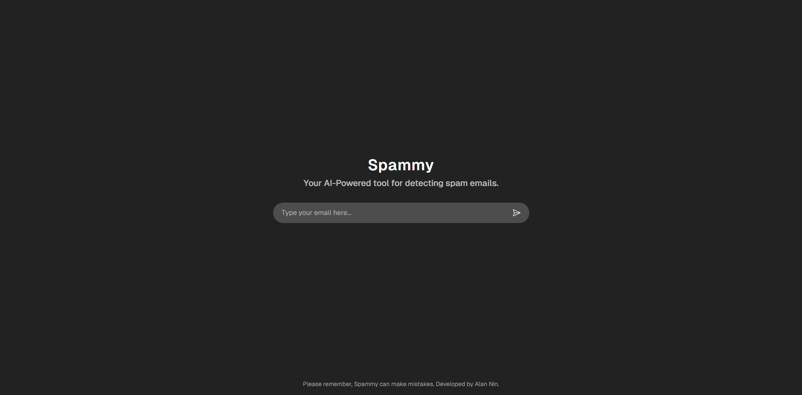

# Spammy - AI-Powered Email Spam Detection

**Spammy** is a web-based application that helps users detect spam emails using an advanced machine learning model. With a simple and intuitive interface, users can input email content and instantly receive feedback on whether the email is classified as spam or not, based on the trained AI model.

## Features

### 1. **Accurate Spam Detection**

- Spammy utilizes a custom-trained machine learning model to accurately detect spam emails.
- The model analyzes email content based on a variety of features including text patterns, keywords, and more.

### 2. **User-Friendly Interface**

- Clean and easy-to-use interface for users to input email text.
- Instant feedback with a clear result of **Spam** or **Not Spam** after model analysis.
- User can check the probability of the email being classified as spam or not.

### 3. **Fast and Efficient**

- Built for speed and accuracy, Spammy processes email content in real-time.
- Lightweight architecture ensures quick response times, even with high traffic.

### 4. **Secure and Private**

- Emails are analyzed locally in the session without being stored, ensuring user privacy.
- Secure encryption is used for communication between the client and server.

### 5. **Custom AI Model**

- Developed with a custom machine learning model trained on a large dataset of spam and non-spam emails.
- Regular updates ensure that Spammy remains effective in detecting evolving spam techniques.

## Technology Stack

- **Frontend**: Next.js (React)
- **Backend**: Python (FastAPI)
- **Machine Learning**: Custom-built model using Python and scikit-learn
- **Deployment**: Vercel (Frontend) and Koyeb (Backend)
- **Security**: HTTPS, encryption for secure communication

## How It Works

1. **Input**: Users can paste or type the email content they want analyzed into the text box.
2. **Detection**: The machine learning model processes the input and runs it through the trained spam detection model.
3. **Result**: Spammy will output the result, either **Spam** or **Not Spam**, with a brief explanation of the analysis.

## How to Get Started

1. Visit our live website: [Spammy](https://spammy.vercel.app)
2. Type your email content into the presented input and press and enter!
3. Done! Now you can check the result of your email being classified as spam or not.

## Model Details

- **Algorithm**: The model is based on [Logistic Regression](https://scikit-learn.org/stable/modules), which is particularly effective for text classification tasks like spam detection.
- **Training Dataset**: The model was trained on thousands of emails labeled as spam and non-spam to achieve high accuracy.
- **Continuous Improvement**: The model is regularly updated with new data to ensure it stays effective against new spam techniques.

## Future Improvements

- **Multiple Language Support**: Expand detection capabilities to analyze emails in different languages.
- **Enhanced Explanation**: Provide users with more detailed reasons why an email was classified as spam.
- **Mobile App**: Develop a mobile-friendly version of Spammy for on-the-go detection.

## Contact

For any inquiries, feel free to reach me out at [alanbusinessnin@gmail.com](alanbusinessnin@gmail.com).
